Wires Specification
###################

.. py:currentmodule:: xbase.layout.mos.base

Overview
========

To enable process portability, XBase classes automatically figure out the size of the primitive
blocks based on user's wires specification.  For example, in a transistor row, if you need 2 wires
to connect to the gate and 3 wires to connect to the drain/source, then XBase knows how to make
the transistor row tall enough to accomodate all these wires.

.. _fig_wires:
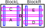

    Example of non-trivial wires specification

This all sounds simple and easy, however, the problem gets complicated really quickly once you
realizes that wire specification could be much more complicated than "3 gate tracks" or
"5 drain and source tracks".  :numref:`fig_wires` Shows an example of how more complex wire
specifications could arise.  In this example, you have two :py:class:`MOSBase` blocks abutted
together (so they need to have the same transistor row configuration), and wire B is shared across
both of them, but the other wires are only used internally by each block.  How can such a wire
configuration be communicated to XBase?

.. _fig_dag:
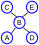

    DAG representing the wires in :numref:`fig_wires`

In general, any wire configurations can be represented by a directed-acyclic-graph (DAG).  The DAG
corresponding to :numref:`fig_wires` is shown in :numref:`fig_dag`.  In this example, an arrow from
A to B implies that wire B must be above wire A, and an arrow from D to B implies that wire B must
be above wire A.  Note that there are no arrows between wire A and wire D, which implies that there
is no constraints on their relative ordering (which makes sense, because they are only used
internally and does not affect each other).

To improve usability, XBase take advantage of Python's dynamically-typed nature and developed a
powerful wire specification format that:

- can be easily written in a YAML file
- looks simple for majority of use cases
- can represent arbitrarily complex wire configurations

the rest of this document describes this format.

Notes
=====

All wires in this specification format are used with :py:class:`TrackManager`.

In the following sections, we'll be shows various examples of vertical wires placed within a
bounding box, but the same applies to horizontal wires.  In all the images, the left edge is
the "lower" end, which is left edge for vertical wires, and bottom edge for horizontal wires.
Also, the YAML representation of each wire representation are shown alongside each figure.

Sequential Wires
================

Basics
------

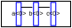

.. code-block:: yaml

    wire_data: ['a<0>', 'b<0>', 'c<0>']
    # or equivalently:
    wire_data: ['a', 'b', 'c']

A set of sequential wires (i.e. one wire follow by another) is represently by a simple
list.  All wire names are buses, in the sense that they have both a name and an index.  The wire
names are represented in CDBA format (i.e. the Virtuoso way).  If the user provide a wire name
without an index, it defaults to an index of 0.

Finally, within the list, index 0 corresponds to the wire with the lowest coordinate, i.e. left-most
or bottom-most wire.

.. code-block:: yaml

    # ERROR!
    wire_data: ['a', 'a']

In particular, this means that the above wire specification (which works for older versions)
is illegal, as wire "a" will be expanded into "a<0>", and "a<0>" followed by itself introduces
a dependency loop, and XBase will raise an error.

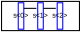

.. code-block:: yaml

    wire_data: ['s<0:2>']

Note that bus notation is supported.  If you write a bus, then XBase will automatically expand
into individual wires.  The bus is expanded such that the first bus index has the smallest index
in the expanded wire list.

Alignment
---------

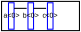

.. code-block:: yaml

    wire_data:
      data: ['a<0>', 'b<0>', 'c<0>']
      align: LOWER_COMPACT

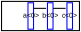

.. code-block:: yaml

    wire_data:
      data: ['a<0>', 'b<0>', 'c<0>']
      align: UPPER_COMPACT

User can also control the alignment of the wires within the block (if there is extra space).  If
the alignment is not specified, a default alignment is chosen based on the underlying primitives.
To specify alignment, use a dictionary where the "data" field stores the list of wires, and "align"
field stores the desired alignment.  See source code for available alignment choices.

Shared Wires
------------

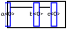

.. code-block:: yaml

    wire_data:
      data: ['a<0>', 'b<0>', 'c<0>']
      align: CENTER_COMPACT
      shared: ['a<0>']

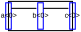

.. code-block:: yaml

    wire_data:
      data: ['a<0>', 'b<0>', 'c<0>']
      align: CENTER_COMPACT
      shared: ['a<0>', 'c<0>']

Sometimes it makes sense to share a wire with adjacent block (usually supply wires).  To do so,
add a "shared" field with a list of wires to place on the boundary.  Note that you can only share
wires at the edges (i.e. no parents or no children in the DAG).

Placement Constraints and Wire Types
------------------------------------
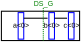

.. code-block:: yaml

    wire_data: ['a<0>', ['b<0>', 'DS_G'], 'c<0>']

Some XBase classes (like :py:class:`MOSBase`) defines various placement types so user can
fine tune wire locations with respect to the primitive devices.  To specify placement types
for a wire, use a tuple of ``(wire_name, placement_type)`` instead of just the wire name.  An
empty string placement type corresponds to the default placement type (which is defined by each
class).

.. code-block:: yaml

    wire_data: ['a<0>', ['b<0>', '', 'foo'], 'c<0>']

As all wires are meant to be used with :py:class:`TrackManager`, by default the wire name are
used to query for width and spacing constraints from the :py:class:`TrackManager`.  To specify
a wire type different from the wire name, you can use a 3-element tuple and put the wire type
in the third field.  Use empty string as a place holder for the placement type if needed.

Wire Graphs
===========

Multiple Wire Groups
--------------------
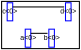

.. code-block:: yaml

    wire_data:
      - ['a<0>', 'b<0>']
      - ['c<0>', 'd<0>']

To construct multiple sequential wires (called "WireGroup"), simply use a list-of-lists.
The block will be sized to accomodate all of them.

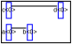

.. code-block:: yaml

    wire_data:
      data:
        - ['a<0>', 'b<0>']
        - ['c<0>', 'd<0>']
      align: LOWER_COMPACT

The default alignment for all WireGroups are set by the underlying primitives.  However, you can
override the default alignment by using a dictionary with "data" and "align" fields, just like in
the sequential wires case.

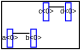

.. code-block:: yaml

    wire_data:
      data:
        - ['a<0>', 'b<0>']
        - wires: ['c<0>', 'd<0>']
          align: UPPER_COMPACT
      align: LOWER_COMPACT

You can also specify different alignments for each WireGroup.  To do so, use dictionary with
"wires" and "align" fields.  In the above example, the default alignment is ``LOWER_COMPACT``,
but for the second wire group it is ``UPPER_COMPACT``.

Sharing Wires Between Groups
----------------------------
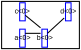

.. code-block:: yaml

    wire_data:
      - ['a<0>', 'b<0>']
      - ['c<0>', 'b<0>', 'd<0>']

To share a wire between two WireGroups, simply repeat the shared wire name in the second group.
Basically, if a WireGroup mention a wire that already exists in the DAG, it will reference that
wire instead.

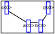

.. code-block:: yaml

    wire_data:
      - wires: ['a<0>', 'b<0>']
        align: UPPER_COMPACT
      - wires: ['c<0>', 'b<0>', 'd<0>']
        align: LOWER_COMPACT

If two WireGroups share some wires, but they have conflicting alignment specification, what
happens?

XBase aligns the WireGroups in the order given.  In this example, XBase will first try to move
wires "a<0>" and "b<0>" as far to the right as possible, squeezing "d<0>" to the right in the
process.  Then, wires in the first WireGroup are locked into place, and XBase proceeds to move the
following WireGroup.  In this case, "c<0>" is moved to the left as much as possible, "b<0>" is
skipped because it is already locked into place, then finally, "d<0>" cannot move at all, so it
stays where it is.

As the result of this alignment algorithm, if you have conflicting alignment requirements,
you should put important WireGroups as early in the list as possible.

.. _sec_summary:

Summary
=======

In summary, the wire specification data structure can be described by the following definition
below, written in psuedo-typehint format:

.. code-block:: python

    WireData = Union[WireGraph, {data=WireGraph, align=Alignment, shared=List[str]}]
    WireGraph = Union[WireGroup, List[WireGroup]]
    WireGroup = Union[WireList, {wires=WireList, align=Alignment}]
    WireList = List[Wire]
    Wire = Union[name, (name, placement_type), (name, placement_type, wire_type)]

For example, follows shows an example which uses all possible optional fields:

.. code-block:: yaml

    wire_data:
      data:
        - ['foo', 'bar', 'baz']
        - wires: ['a', 'bar', 'baz']
          align: LOWER_COMPACT
        - ['sig<0:1>', ['cat', 'DS_G']]
        - ['cat', ['dog', 'DS_MATCH', 'dragon']]
      align: CENTER_COMPACT
      shared: ['foo', 'dog']
